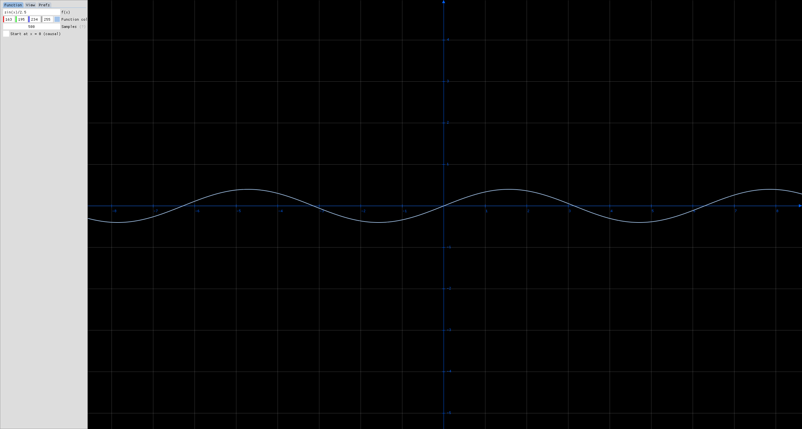

# ImGUI function plotter

A cross-platform mathematical function plotter built with Dear ImGui, OpenGL, GLFW, and ExprTk.

Works on Windows, macOS, and Linux.

---

## Features

- Function plotting using ExprTk expressions
- Mouse-based zoom and pan
- Reset view with **R**
- Grid and axes with scalable ticks
- Causal and symmetric domain modes
- Dockable or floating UI panel
- Tabbed interface (Function, View, Preferences)
- Adjustable colors and sampling rate
- Persistent configuration via `config.ini`

---

## Demo

  

---

## Quick Start

### 1. Download Dependencies

#### macOS / Linux
'''bash
./setup_dependencies.sh
'''

#### Windows
'''batch
setup_dependencies.bat
'''

---

### 2. Build

#### macOS / Linux
'''bash
./build.sh
'''

#### Windows
'''batch
build.bat
'''

---

### 3. Run

'''bash
# macOS / Linux
./build/bin/function-plotter

# Windows
.\build\bin\Release\function-plotter.exe
'''

---

## Project Structure

'''
src/
├── core/
│   ├── App.h/cpp
│   ├── Config.h/cpp
│   └── Animation.h
├── ui/
│   ├── GuiManager.h/cpp
│   └── Animation.h
├── render/
│   ├── RendererGL.h/cpp
│   └── Scene.h/cpp
└── Animation.h
'''

---

## Manual Build

See `BUILD.md` for detailed platform-specific build instructions.

---

## Requirements

- CMake 3.15+
- C++17 compiler
- OpenGL 3.0+
- Dear ImGui
- GLFW
- ExprTk (header-only)

---

## Configuration

Saved in `config.ini`:

- Function expression
- Grid scale and spacing
- Colors
- Sampling resolution
- Panel layout
- View offsets and domain mode

---

## Controls

| Action | Input |
|------|------|
| Zoom | Mouse wheel |
| Pan | Left-click drag |
| Reset | R |
| Edit function | Function tab |
| Grid / colors | View tab |
| Preferences | Prefs tab |

---

## Repository Layout

'''
function-plotter/
├── main.cpp
├── src/
│   ├── App.cpp/h
│   ├── RendererGL.cpp/h
│   ├── GuiManager.cpp/h
│   ├── Scene.cpp/h
│   └── Config.cpp/h
├── external/
│   ├── imgui/
│   ├── glfw/
│   └── exprtk/
├── CMakeLists.txt
└── README.md
'''
